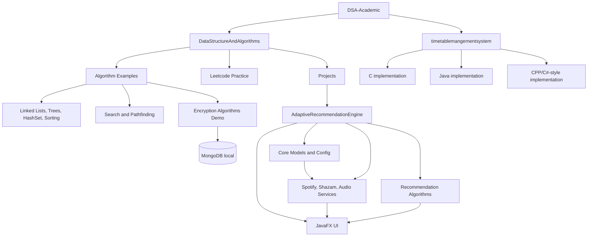

<!-- Author: Noman Shakir -->

# Project Knowledge Graph

## Architecture



## Data Models

- `Track`: music track metadata used by the adaptive recommendation engine.
- `Trie`: prefix-search structure for fast lookup and suggestion workflows.
- Linked list, tree, sorting, and search examples: standalone educational data structures.
- Encryption demo models: user/document records persisted through local MongoDB collections.

## API Contracts

- Spotify Web API:
  - OAuth authorization code flow.
  - Token endpoint at `https://accounts.spotify.com/api/token`.
  - Catalog/player endpoints under `https://api.spotify.com/v1`.
- ACRCloud/Audd-style recognition:
  - Audio sample upload for song identification.
- Local encryption demo:
  - Python controller/view/model functions over local storage and MongoDB.

## Auth Flows

- Adaptive recommendation engine uses Spotify OAuth redirect to `http://127.0.0.1:8888/callback`.
- Encryption demo uses role constants for `Admin` and `User`; no production-grade session flow is documented.

## Infrastructure

- Java 21 Maven project for `AdaptiveRecommendationEngine`.
- JavaFX 21 desktop UI.
- Local MongoDB for the Python encryption demo.
- Standalone Java, Python, C, and C++ academic algorithm examples.

## JSON Schema

```json
{
  "project": "DSA-Academic",
  "modules": [
    {
      "name": "DataStructureAndAlgorithms",
      "type": "academic-library",
      "children": ["Algorithms", "Leetcode", "projects"]
    },
    {
      "name": "AdaptiveRecommendationEngine",
      "type": "javafx-maven-app",
      "dependencies": ["Spotify Web API", "ACRCloud/Audd-style recognition", "JavaFX", "Gson"]
    },
    {
      "name": "encryptionalgorithms",
      "type": "python-security-demo",
      "dependencies": ["MongoDB", "PyCryptodome-style crypto utilities"]
    },
    {
      "name": "timetablemangementsystem",
      "type": "academic-examples",
      "languages": ["C", "Java", "C++"]
    }
  ],
  "external_services": ["Spotify Web API", "ACRCloud/Audd", "MongoDB local"],
  "author": "Noman Shakir"
}
```
